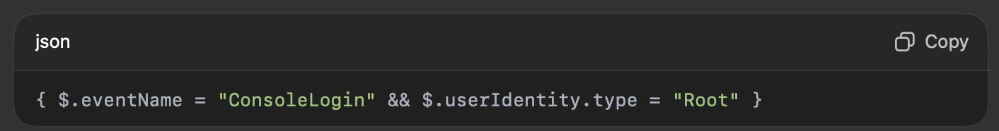

Project Title:

“Tracking and Auditing AWS Account Activity Using CloudTrail and CloudWatch”

⸻

🎯 Objective

Implement a monitoring and auditing solution using AWS CloudTrail to track user actions, API calls, and resource changes — and integrate it with CloudWatch for real-time alerts on critical activities (like IAM policy changes or root user logins).

⸻

🌩️ Real-World Use Case

In most organizations, multiple engineers or teams access AWS resources. To maintain security, compliance, and accountability, it’s crucial to know:
	•	Who made changes to AWS infrastructure
	•	What actions were taken (create, delete, modify)
	•	When and from where these actions occurred

This project simulates a real DevOps monitoring scenario where you set up auditing, alerting, and incident visibility using CloudTrail.

⸻

🧠 Architecture Overview

Flow:
	1.	AWS CloudTrail records all user and API activity.
	2.	The trail logs are stored securely in an S3 bucket.
	3.	CloudTrail is integrated with CloudWatch Logs for real-time event monitoring.
	4.	CloudWatch Alarms send notifications to an SNS topic, alerting the DevOps team of suspicious activities (like root logins or security group changes).

Tools Used:
	•	AWS CloudTrail
	•	S3 Bucket
	•	CloudWatch Logs
	•	SNS (Simple Notification Service)
	•	IAM

⸻

⚙️ Step-by-Step Implementation

Step 1: Create an S3 Bucket for CloudTrail Logs
	•	Go to S3 Console → Create Bucket
	•	Example name: my-company-cloudtrail-logs
	•	Enable versioning and default encryption (SSE-S3) for data protection

⸻

Step 2: Enable CloudTrail
	•	Go to CloudTrail Console → Create Trail
	•	Choose Management events (Read/Write)
	•	Select All Regions (for complete visibility)
	•	Choose the S3 bucket you created earlier
	•	Enable CloudWatch Logs integration

Now CloudTrail records every AWS API event across services.

⸻

Step 3: Create a CloudWatch Metric Filter

Go to CloudWatch → Logs → Metric Filters → Create Filter
Use a pattern to detect sensitive activity, e.g.:

This detects root user console logins.
Step 4: Create a CloudWatch Alarm
	•	Go to CloudWatch → Alarms → Create Alarm
	•	Choose the metric from your filter
	•	Set a threshold (e.g., >= 1)
	•	Add an SNS topic to send email alerts

You’ll receive an email notification whenever a root login or sensitive event occurs.

⸻

Step 5: Test and Validate
	1.	Log in to AWS using the root account (or trigger any IAM change).
	2.	CloudTrail logs the event in S3 and CloudWatch.
	3.	The CloudWatch Alarm detects the activity and sends an alert via SNS email.

⸻

📊 Example Scenario
	•	Event: Developer mistakenly deletes an EC2 instance.
	•	CloudTrail Log: Records TerminateInstances API call with username, timestamp, and IP address.
	•	CloudWatch Filter: Detects the “TerminateInstances” event.
	•	SNS Alert: Emails DevOps team instantly — “Alert: EC2 Termination Detected.”

This allows immediate investigation and rollback via Terraform or backup snapshots.

⸻

✅ Key Benefits
	•	Full visibility into AWS account activity
	•	Helps in security auditing and compliance (SOC2, ISO, GDPR)
	•	Enables real-time threat detection and response
	•	Simplifies root cause analysis after incidents

⸻

🚀 Extension Ideas
	•	Forward CloudTrail logs to AWS OpenSearch (Elasticsearch) for advanced querying.
	•	Use AWS Lambda to auto-remediate issues (e.g., disable root access).
	•	Integrate with Slack or Microsoft Teams for instant alerting.

⸻

🧾 Summary

This CloudTrail-based monitoring system helps organizations maintain audit readiness, security visibility, and operational accountability.
It’s a real-world DevOps solution every AWS environment should have as part of its governance and monitoring strategy.